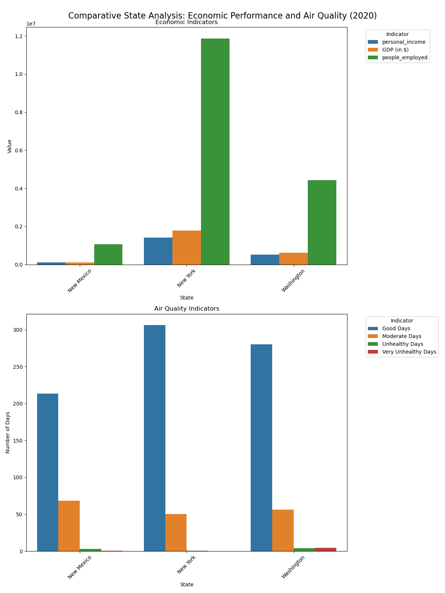

# python_project_1

## Table of Contents
* [Research Question](#research-question)
* [Analyses](#analyses)
* [Usage](#usage)
* [Installation](#installation)
* [Dependencies](#dependencies)
* [Citations](#citations)

## Research Question
"How do economic growth and air quality metrics interact, and what implications do these interactions have for public health strategies?"
* Params
- Locations: NY, WA, NM
- Timeframe: 2015 - 2020

## Analyses

### Analysis #1
Comparative State Analysis: Recent Economic Performance vs. Air Quality
- This establishes a baseline understanding of how the latest economic indicators relate to air quality metrics in our chosen states. providing a snapshot of whether states with stronger economies maintain better or worse air quality. 

Conclusion:
- These findings imply that effective environmental policies,geographical factors, and the nature of economic activitiesplay crucial roles in determining air quality alongside economic performance. Further research into specific industries, population density, and environmental regulations would provide more comprehensive insights into these relationships.
- The analysis challenges the common assumption that higher economic activity leads to poorer air quality, as demonstrated by New York's superior performance in both economic metrics and good air quality days (306 days) compared to the smaller economies of Washington (280 days) and New Mexico (213 days).

### Analysis #2
Time Series Analysis: GDP vs. AQI for New York State & Washington
- This analysis examines the relationship between economic growth (measured by GDP) and air quality (measured by Max AQI) in New York State and Washington from 2015 to 2020. 
- It aims to reveal potential correlations or divergences between economic performance and environmental quality over time in both states given that Washington had the most 'Very Unhealthy Days'.

Conclusion:
- From 2015 to 2020, New York's GDP grew from approximately $1.5 trillion to $1.77 trillion, reflecting consistent economic expansion despite a slight dip in 2020 due to the pandemic, while Washington's GDP increased steadily from $467 billion in 2015 to $620 billion in 2020, showcasing robust economic growth.
- Unlike New York, Washington's GDP and Max AQI trends diverged more noticeably, indicating that economic growth may have coincided with periods of poorer air quality. The differingtrends between New York and Washington highlight the importance of tailored environmental policies and management strategies to balance economic growth with air quality maintenance.
- These findings underscore the critical need for integrated public health strategies that address the environmental impacts of economic activities, ensuring that economic prosperity does not come at the cost of public health.

### Analysis 3
Time Series Analysis: Health vs. AQI for New York, New Mexico, and Washington States
- This analysis examines the relationship between health (measured by chronic respiratory related POD and air quality (measured by Max AQI) in New York, New Mexico, and Washington from 2015 to 2020.
- It aims to reveal potential correlations or divergences between upper resiratory diseases and air quality over time in three states given that Washington had the most 'Very Unhealthy Days'.

Conclusion:
- From 2015 to 2020, New York's Chronic Respiratory Related POD (%) remain steady up until 2019 and then had a significant drop most likely due to the pandemic and the air quality improved for a time since everything was shut down. While Washington's and New Mexico's Chronic Respiratory Related POD (%) decreased steadily from 2.8 to 2.4 and 3.0 to 2.3 respectively showing that New Mexico showed a faster improvement.
- These findings show that even though Chronic Respiratory Related POD (%) are declining, the impact air quality has doesn't seem to be a contributing factor in the root cause of this disease 
- Regardless these findings underscore the critical need for integratedpublic health strategies that address the environmental impacts affectingair quality which can lead to fewer health problems such as upperrespiratory issues.

## Usage
- 'Resources' dir hosts all raw tables as well as the scripts to manipulate them
    - Refer to the 'scripts' directory of each respective subject to generate the combined file
- The 'main' notebook file reads the final csv for each subject
    - running this file will combine said tables and create the 'master' csv
    - additionally all graphs are generated and shown through this file

## Installation
1. `git clone git@github.com:harrismhurley/python_project_1.git`
2. Install required dependencies
3. Refer to 'Usage' to generate source files

## Dependencies
- python: 3.10.15
- pandas: 2.2.2
- matplotlib.pyplot: 3.9.2
- pathlib: 16.2.0
- altair: 5.0.1 
- requests: 2.32.3
- json: 0.9.6

## Citations
U.S. Bureau of Economic Analysis. (2024). Regional GDP & Personal Income, 2015-2020[Data set]. U.S. Department of Commerce. Available from [BEA.gov/iTable](BEA.gov/iTable)

U.S. Environmental Protection Agency. (2024). Air Quality Index (AQI) by County, 2015-2020 [Data set]. Air Quality System Data Mart. Available from [https://aqs.epa.gov/aqsweb/airdata/download_files.html](https://aqs.epa.gov/aqsweb/airdata/download_files.html)
Global Burden of Disease Collaborative Network. Global Burden of Disease Study 2021 (GBD 2021) Results. Seattle, United States: Institute for Health Metrics and Evaluation (IHME), 2022.[https://vizhub.healthdata.org/gbd-results/](https://vizhub.healthdata.org/gbd-results/)
